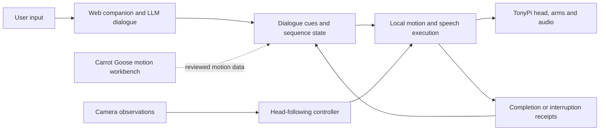
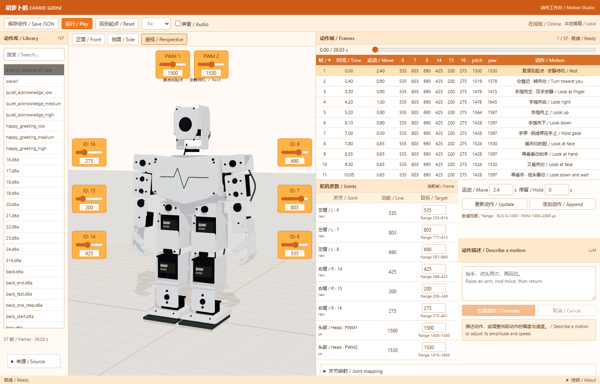

# Embodied Conversation

A physical robot project exploring how gaze, gesture and speech accompany LLM-based conversation.

I connected the Carrot Duck web companion to a TonyPi robot and developed sequences for attention shifts, playful responses and an invitation to hug. The system combines perception, dialogue cues, coordinated head and arm movement, voice playback and execution feedback. Carrot Goose, the supporting browser workbench, helps inspect and revise motion before physical rehearsal.

[](https://youtu.be/SYHgv-Zi3hE)

[Watch the robot demonstration](https://youtu.be/SYHgv-Zi3hE) · [Open the workbench](https://carrotgoose.online/) · [Carrot Duck](https://github.com/carrotduck/carrot-duck)

[Project website](https://shiruifu.online/projects/embodied-robot/) presents the design question and development process.

## System architecture



The interaction loop advances through dialogue cues and execution feedback. Perception can drive head-following. LLM-based dialogue, language-assisted motion authoring and local robot execution have distinct roles. The workbench exports motion data for review.

## Physical interaction

The demonstration shows dialogue-linked attention, a playful reply and an invitation to hug. The local controller returns completion or interruption feedback, while short voice cues play through the attached audio device.

| Component | Documentation |
| --- | --- |
| Motion and perception | [Robot modules](docs/robot.md) |
| Web events, speech and execution feedback | [Rehearsal runtime](docs/rehearsal.md) |
| Evidence and current scope | [Validation status](docs/validation.md) |
| Dialogue and gesture sequence | [Performance score](docs/performance.md) |

## Carrot Goose · supporting workbench



Choose a motion, scrub its timeline and edit a frame's joint targets. The workbench shows the values used across the selected sequence. A language request can generate a new movement or change the amplitude and speed of the current one.

Moving a slider previews the corresponding joint immediately. Connector lines identify the controlled joint as the camera moves. Select **Update** to save the preview as a frame. The separate **Offset** field adjusts the model's calibration preview and is exported with the mapping.

Try “Raise an arm, nod twice, then return” or “Reduce the current amplitude to 70% and halve the speed.”

**Analyze motion library** scans loaded sequences for pauses, direction changes, returns and event boundaries. Select a candidate, adjust its start and end frames, preview it, then name and confirm it. Saved fragments retain source frames and entry/exit poses, persist in this browser and can be exported together. The analyzer proposes kinematic fragments; expressive meanings are assigned during review. See [motion segmentation](docs/segmentation.md).

The workbench contains 138 motion sequences. Import your own TonyPi action folder to build a local library:

```sh
python tools/import_actions.py /path/to/ActionGroups
```

The importer reads all servo channels in each `.d6a` file. The 3D preview supports full-body joint movement. The photo-based model is intended for inspecting timing and poses. Physical joint directions and travel limits require calibration.

## Run

Install Node.js 22 or newer, then:

```sh
npm ci
npm start
```

Open `http://127.0.0.1:8770`. Editing and playback work locally. For language planning, copy `.env.example` to `.env`, fill in your provider credentials, and start with:

```sh
node --env-file=.env server.mjs
```

The local server listens on this computer only. The hosted workbench generates motions without a Carrot Duck account. Model credentials stay on the server; requests have per-client and shared limits. [Integration notes](docs/integration.md) explain that connection and the dedicated Carrot Goose domain.

## Project files

| Directory | Contents |
| --- | --- |
| `apps/studio` | Browser model, frame editor and motion validation |
| `robot` | Robot client, perception, motion compiler, command handling and voice integration |
| `robot/rehearsal` | Scene runner, webpage event transport, head/arm coordination and audio playback |
| `integrations/duck` | Independent workbench planning and companion integration adapter |
| `tools` | Action import and analysis |
| `unreal` | UE 5.7 editor scripts for the block-model preview |

The robot modules preserve the rehearsal implementation and its own joint conventions. They are reference components for an existing TonyPi installation. See [robot setup](docs/robot.md) before adapting them to another robot.

## Development

```sh
npm test
pip install -r robot/requirements.txt
python -m unittest discover -s robot -p "test_*.py"
python -m unittest discover -s robot/rehearsal -p "test_*.py"
```

The [demonstration](https://youtu.be/SYHgv-Zi3hE) follows a short exchange from attention to a playful response and an invitation to hug. Carrot Duck provides the companion research context; Carrot Goose focuses on physical expression and rehearsal.

## References

[Hiwonder TonyPi](https://github.com/Hiwonder/TonyPi) provides the platform code and action-file reference. [URDF Loaders](https://github.com/gkjohnson/urdf-loaders) is a useful reference for future calibrated robot models. The browser currently uses Three.js and a procedural model. Dependency attribution is in [THIRD_PARTY_NOTICES.md](THIRD_PARTY_NOTICES.md).

See [joint mapping and editing](docs/full-body-preview.md).
