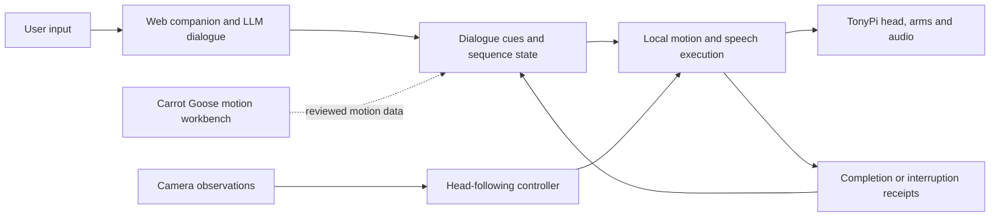

# CARROT GOOSE

A robot companion exploring how physical gestures make a conversational response feel directed towards a person.

I connected the Carrot Duck companion to a TonyPi robot and designed how it turns towards a user, responds playfully and offers a hug. I also built a browser workbench to inspect poses and revise their timing before trying them on the robot.

[](https://youtu.be/SYHgv-Zi3hE)

[Watch the robot demonstration](https://youtu.be/SYHgv-Zi3hE) · [Open the workbench](https://carrotgoose.online/) · [Carrot Duck](https://github.com/carrotduck/carrot-duck)

[Project website](https://shiruifu.online/projects/embodied-robot/) presents the design question and development process. The browser workbench uses Three.js; the [Unreal Engine preview](unreal/README.md) provides editor scripts for generating a simplified robot scene and Level Sequences.

## System architecture



The web companion sends dialogue cues to a local controller, which coordinates movement with short voice clips and reports when execution finishes or is interrupted. Camera observations support head-following. Motions are edited in the workbench and reviewed before physical use.

## Physical interaction

In the hug sequence, the robot faces the user and raises an arm before opening both arms. This lead-in is part of the design question: does the gesture feel responsive to the conversation? A [proposed study](docs/research-framing.md) would vary when the gesture begins relative to the reply.

| Component | Documentation |
| --- | --- |
| Motion and perception | [Robot modules](docs/robot.md) |
| Web events, speech and execution feedback | [Rehearsal runtime](docs/rehearsal.md) |
| Evidence and current scope | [Validation status](docs/validation.md) |
| Dialogue and gesture sequence | [Performance score](docs/performance.md) |

## Carrot Goose · supporting workbench


Choose a motion, scrub its timeline and edit a frame's joint targets. The workbench shows the values used across the selected sequence. A language request can generate a new movement or change the amplitude and speed of the current one.

Moving a slider previews the corresponding joint immediately. Connector lines identify the controlled joint as the camera moves. Select **Update** to save the preview as a frame. The separate **Offset** field adjusts the model's calibration preview and is exported with the mapping.

Try “Raise an arm, nod twice, then return” or “Reduce the current amplitude to 70% and halve the speed.”

**Analyze motion library** suggests places to divide a sequence. Preview and adjust each fragment, then name and save it for reuse. [Motion segmentation](docs/segmentation.md) explains the analysis and export process.

The hosted workbench contains 138 motion sequences; this public repository bundles three example sequences. Import your own TonyPi action folder to build a local library:

```sh
python tools/import_actions.py /path/to/ActionGroups
```

The importer reads all servo channels in each `.d6a` file. The 3D preview supports full-body joint movement.

## Run

Install Node.js 22 or newer, then:

```sh
npm ci
npm start
```

Open `http://127.0.0.1:8770`. Editing and playback work locally. For language planning, copy `.env.example` to `.env`, fill in your provider credentials, and start with:

```sh
node --env-file=.env server.mjs
```

The hosted workbench can be used without a Carrot Duck account. See [Integration notes](docs/integration.md) for planning-service configuration and request limits.

## Project files

| Directory | Contents |
| --- | --- |
| `apps/studio` | Browser model, frame editor and motion validation |
| `robot` | Robot client, perception, motion compiler, command handling and voice integration |
| `robot/rehearsal` | Scene runner, webpage event transport, head/arm coordination and audio playback |
| `integrations/duck` | Independent workbench planning and companion integration adapter |
| `tools` | Action import and analysis |
| `unreal` | UE 5.7 editor scripts for the block-model preview |

The robot modules preserve the rehearsal implementation and its own joint conventions. They are reference components for an existing TonyPi installation. See [robot setup](docs/robot.md) before adapting them to another robot.

## Development

```sh
npm test
pip install -r robot/requirements.txt
python -m unittest discover -s robot -p "test_*.py"
python -m unittest discover -s robot/rehearsal -p "test_*.py"
```

## References

[Hiwonder TonyPi](https://github.com/Hiwonder/TonyPi) provides the platform code and action-file reference. [URDF Loaders](https://github.com/gkjohnson/urdf-loaders) is a useful reference for future calibrated robot models. The browser currently uses Three.js and a procedural model. Dependency attribution is in [THIRD_PARTY_NOTICES.md](THIRD_PARTY_NOTICES.md).

See [joint mapping and editing](docs/full-body-preview.md).
