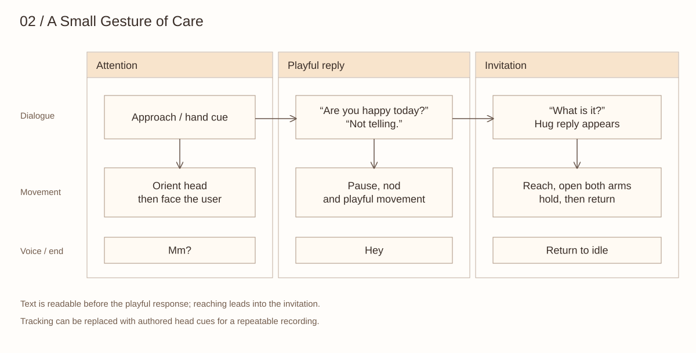

# A Small Gesture of Care

This performance score connects dialogue cues to attention, movement and speech. The exact trajectories remain in `apps/studio/library.json`; the score describes the expressive purpose of their transitions.

| Beat | Cue | Physical expression | Transition |
| --- | --- | --- | --- |
| Attention | User approaches or presents a hand | Orient the head, pause, then face the user; “Mm?” | Leave room for the opening question |
| Question | “Are you happy today?” | Hold attention towards the user | Wait for the reply cue |
| Playful response | “Not telling.” appears | Pause, nod and perform the composed cheer | Let the text register before movement |
| Invitation begins | Hand withdrawal cue | Raise an arm, hesitate, say “Hey,” then reach again | Keep the invitation legible |
| Second question | “What is it?” | Hold the reach | Await the hug reply |
| Hug | “Just wanted to give you a hug. Hope you’re having a good day, too.” | Prepare and open both arms, hold, lower and return | Complete the return before the next take |

Hand tracking was tested on the physical robot; the controller adjusts head orientation to follow the hand.

## Speech and execution

The physical demonstration used generated “Mm?” and “Hey” clips played through the attached audio device. The public repository does not include voice credentials or those audio files. Configure playback in the device installation and coordinate it with the corresponding sequence beat.

The rehearsal controller uses execution feedback to distinguish completion from interruption. The workbench's playback log describes browser playback only. Its exported motion must be reviewed against the device's servo conventions and starting pose before physical execution.

## Reusable actions

Orientation, hold, nod, arm lift, invitation and return are useful compositional units. A shoulder lift and its return can be separate units, allowing a pause or head turn between them. Returning should use the appropriate transition from the current pose, especially where a hand passes near a leg.

The design question is whether the lead-in makes the invitation feel directed towards the user. See the [proposed comparison](research-framing.md) for how gesture timing could be evaluated.
